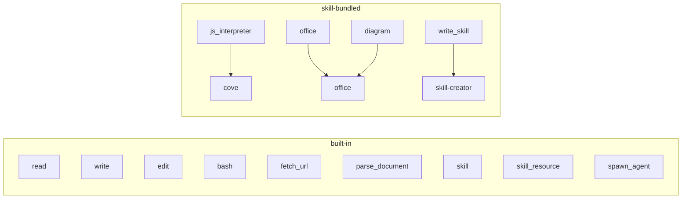
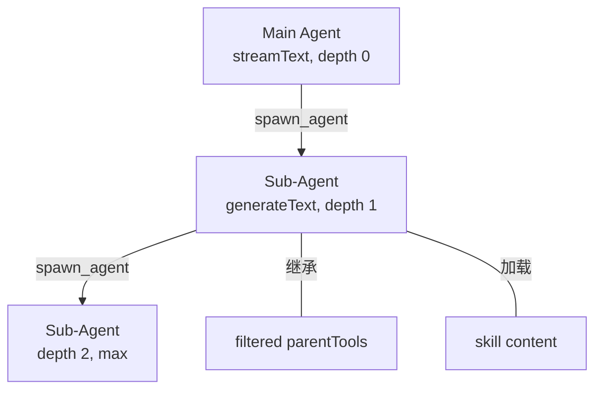

# Agent, Tool & Skill 架构

本文档描述 Cove 的 Agent / Tool / Skill 三层架构及其关联关系。

## Tool 分类

所有工具分为两类：

| 分类 | 说明 | 注册方式 |
|------|------|----------|
| **built-in** | 始终可用的核心工具 | 无条件注册 |
| **skill-bundled** | 由 Skill 提供的扩展工具 | 需 Skill 启用 + 运行时检查通过 |



### Skill 门控逻辑

`getAgentTools()` 通用门控，无 hardcoded 判断：

```
对于每个 skill-bundled 工具:
  1. skillName 对应的 Skill 是否已启用？
  2. runtimeCheck 对应的运行时依赖是否可用？
  两者都满足 → 注册；否则跳过
```

## Sub-Agent 架构

Sub-agent 通过 `spawn_agent` 工具创建，使用 `generateText()` 独立运行，对用户不可见。



- **深度限制**: `maxDepth = 2`，防止无限递归
- **AbortSignal**: 从 main agent 传播到所有 sub-agent
- **工具集**: 继承父 agent 工具的子集（可通过 `toolIds` 过滤）

## 重命名映射（#172）

| 旧名 | 新名 | 说明 |
|------|------|------|
| `officellm` (tool) | `office` | TS 层重命名，Rust 命令不变 |
| `render_mermaid` (tool) | `diagram` | 去技术化命名 |
| `code-interpreter` (skill) | `cove` | 合并为核心 skill |
| `core / extension` (分类) | `built-in / skill-bundled` | 语义更清晰 |

Settings 自动迁移：
- `skillsStore`: `SKILL_NAME_MIGRATIONS` (`officellm→office`, `code-interpreter→cove`)
- `toolsStore`: `TOOL_ID_MIGRATIONS` (`officellm→office`, `render_mermaid→diagram`)
