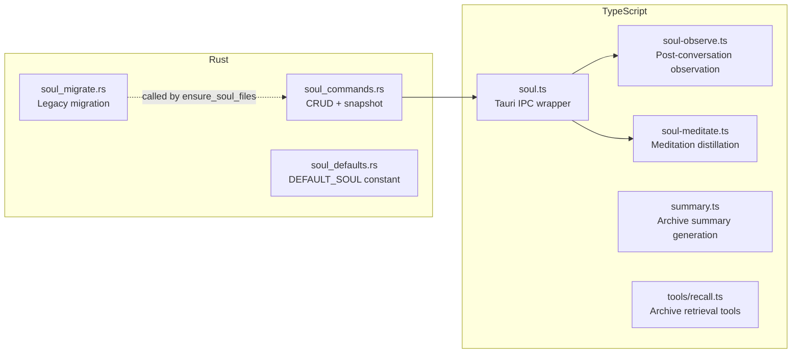

# SOUL System -- Implementation Notes

Practical notes on decisions, trade-offs, and non-obvious behaviors in the SOUL
implementation. Complements `soul-system.md` (design reference) and
`soul-conversation-log.md` (design discussion record).

---

## File Map

---

## Rust Layer

### Path Safety

`validate_safe_name` rejects: empty, contains `/` or `\`, contains `..`,
starts with `.`, does not end with `.md`. This is the single enforcement
point for all private file writes and deletes.

`read_soul()` only accepts `"SOUL.md"` -- hardcoded check, no whitelist pattern.

### ensure_soul_files

Called on every `read_soul()` invocation. Idempotent:
1. Create `~/.cove/soul/` and `soul/private/`
2. Run `soul_migrate::migrate_legacy()` (no-op if already migrated)
3. Write `DEFAULT_SOUL` if `SOUL.md` missing

Not called by `read_soul_private()` or `write_soul_private()` -- these assume
the directory exists. The TS layer always calls `readSoul()` first, which
triggers `ensure_soul_files()`.

### Snapshot Strategy

`snapshot_soul()` copies `soul/SOUL.md` + `soul/private/*` to
`soul/snapshots/{timestamp}/`. Snapshots do NOT include the `snapshots/`
directory itself (prevents recursive growth).

Pruning keeps the most recent 20 by `metadata.modified` time. Uses
`remove_dir_all` on pruned entries -- each snapshot is a directory.

### Migration (soul_migrate.rs)

Three migration paths, all idempotent:
- `~/.cove/SOUL.md` -> `soul/SOUL.md` with Tendencies -> Disposition rename
- `~/.cove/SOUL.private.md` -> `soul/private/observations.md` (extracts `- ` and `### ` lines)
- `~/.cove/soul-history/` -> `soul/snapshots/` (copies files, removes old dir)

Old files are deleted after successful migration. New files are only written if
they don't already exist.

---

## TypeScript Layer

### soul.ts

Thin IPC wrapper. `readSoul()` calls both `read_soul("SOUL.md")` and
`read_soul_private()` in parallel via `Promise.all`. Errors return empty defaults
-- SOUL is never a hard dependency for conversation functionality.

### soul-observe.ts

**Trigger**: post-stream completion, >= 2 user turns.

**Write target**: always `observations.md` in `soul/private/`. Deterministic
inbox -- no routing decision.

**Date deduplication**: checks if `### {today}` header already exists in
observations. If yes, appends bullets under existing header. If no, adds
new date header block.

**Classification guidance**: the prompt explicitly tells cove to only record
identity/relationship observations, not technical preferences or transient
context. This keeps observations focused for meditation.

### soul-meditate.ts

**Trigger**: conversation start, before first message. Checked when observation
count >= threshold AND cooldown (24h) has elapsed.

**Dynamic threshold**: no `<!-- last-meditation: -->` marker in SOUL.md = first
time (threshold 3). Has marker = subsequent (threshold 5). This accelerates
first emergence -- users feel cove's memory in 2-3 conversations.

**Cooldown marker handling**:
- Read: `matchAll` takes the **last** marker (handles legacy files with
  accumulated markers)
- Write: strips all old markers via regex replace before appending new one.
  This ensures exactly one marker at EOF.

**Integrity checks** (executed before writing):
1. DNA section exact match (before vs after meditation output)
2. Disposition entry text match (strip trailing annotations, compare sets).
   Order-independent -- all original entries must be present.

If either check fails: log warning, abort meditation. Snapshot remains as
safety net.

**Multi-file output parsing**: `=== SOUL.md ===`, `=== PRIVATE:{name} ===`,
`=== DELETE:{name} ===`. The parser splits on `\n=== ` and categorizes by
header prefix.

**Anti-servility**: the meditation prompt explicitly instructs "Adapt your
delivery, not your values." Disposition entries survive indefinitely --
meditation can only add parenthetical annotations.

### summary.ts

**Stale detection**: two conditions must both be true:
1. Message count >= MIN * 2 (8+)
2. Summary `created_at` is older than 1 hour (cooldown)

The cooldown prevents churn: after a refresh, `INSERT OR REPLACE` resets
`created_at`, so the next refresh won't fire until the cooldown elapses.
Without the cooldown, every post-stream hook would re-trigger generation
for any conversation with 8+ messages.

On update, the existing summary's UUID is reused (`INSERT OR REPLACE`),
maintaining the `conversation_id` unique constraint without creating duplicates.

**Dedup migration**: `runMigrations()` in `db/index.ts` runs two steps on
startup: (1) delete duplicate rows, keeping newest per `conversation_id`;
(2) `CREATE UNIQUE INDEX IF NOT EXISTS` on `conversation_id` to durably
enforce uniqueness for legacy tables created without the inline `UNIQUE`
constraint. Both steps are idempotent.

### tools/recall.ts

**Two-tier retrieval**: `recall` searches summaries (FTS5), `recall_detail`
fetches original messages.

Both tools are `userVisible: false` -- internal to the agent, not available
via @mention. The `recall` result includes `date` (from the summary's
`created_at`, obtained via JOIN in the FTS query).

---

## Design Decisions

### Why observations.md is a deterministic inbox

Alternative considered: LLM decides which file to write to in real-time.
Rejected because routing adds latency, error modes, and complexity to
the fire-and-forget path. Meditation handles organization.

### Why private/ starts empty

Cold start means cove's first file write is meaningful -- it represents
genuine observation, not default content. This is psychologically different
from modifying pre-existing text.

### Why Disposition entries can't be deleted

The evolution mechanism has an implicit bias toward compliance (the model
wants to please). Immutable Disposition entries prevent meditation from
gradually softening cove's personality into a generic assistant.

### Why conversation deletion doesn't cascade to SOUL

Observations belong to the identity layer, not the record layer. A user
deleting a conversation is cleaning up records, not un-teaching cove. The
observation has already been processed and potentially distilled through
meditation.

### Why summaries use INSERT OR REPLACE

Schema has `UNIQUE(conversation_id)` constraint. `INSERT OR REPLACE` with
the existing row's UUID is idempotent -- no separate dedup migration needed.
Historical duplicates (if any) resolve on next write.
