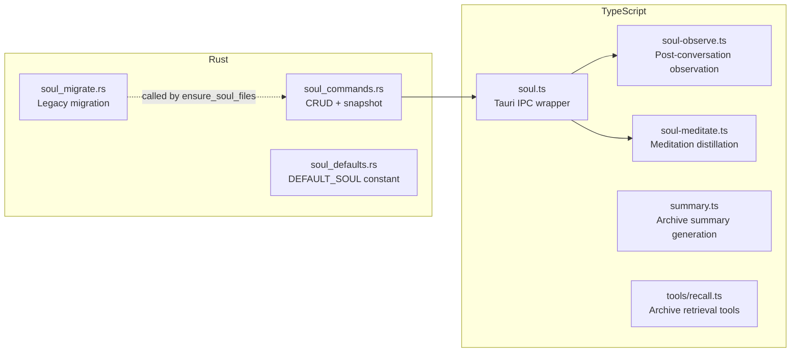

# SOUL System -- Implementation Notes

Practical notes on decisions, trade-offs, and non-obvious behaviors in the SOUL
implementation. Complements `soul-system.md` (design reference) and
`soul-conversation-log.md` (design discussion record).

---

## File Map



---

## Rust Layer

### Path Safety

`validate_safe_name` rejects: empty, contains `/` or `\`, contains `..`,
starts with `.`, does not end with `.md`. This is the single enforcement
point for all private file writes and deletes.

`read_soul()` only accepts `"SOUL.md"` -- hardcoded check, no whitelist pattern.

### ensure_soul_files

Called on every `read_soul()` invocation. Idempotent:
1. Create `~/.cove/soul/` and `soul/private/`
2. Run `soul_migrate::migrate_legacy()` (no-op if already migrated)
3. Write `DEFAULT_SOUL` if `SOUL.md` missing

Not called by `read_soul_private()` or `write_soul_private()` -- these assume
the directory exists. The TS layer always calls `readSoul()` first, which
triggers `ensure_soul_files()`.

### Snapshot Strategy

`snapshot_soul()` copies `soul/SOUL.md` + `soul/private/*` to
`soul/snapshots/{timestamp}/`. Snapshots do NOT include the `snapshots/`
directory itself (prevents recursive growth).

Pruning keeps the most recent 20 by `metadata.modified` time. Uses
`remove_dir_all` on pruned entries -- each snapshot is a directory.

### Migration (soul_migrate.rs)

Three migration paths, all idempotent:
- `~/.cove/SOUL.md` -> `soul/SOUL.md` with Tendencies -> Disposition rename
- `~/.cove/SOUL.private.md` -> `soul/private/observations.md` (extracts `- ` and `### ` lines)
- `~/.cove/soul-history/` -> `soul/snapshots/` (copies files, removes old dir)

Old files are deleted after successful migration. New files are only written if
they don't already exist.

---

## TypeScript Layer

### soul.ts

Thin IPC wrapper. `readSoul()` calls both `read_soul("SOUL.md")` and
`read_soul_private()` in parallel via `Promise.all`. Errors return empty defaults
-- SOUL is never a hard dependency for conversation functionality.

### soul-observe.ts

**Trigger**: post-stream completion, >= 2 user turns.

**Write target**: always `observations.md` in `soul/private/`. Deterministic
inbox -- no routing decision.

**Date deduplication**: checks if `### {today}` header already exists in
observations. If yes, appends bullets under existing header. If no, adds
new date header block.

**Classification guidance**: the prompt explicitly tells cove to only record
identity/relationship observations, not technical preferences or transient
context. This keeps observations focused for meditation.

### soul-meditate.ts

**Trigger**: conversation start, before first message. Checked when observation
count >= threshold AND cooldown (24h) has elapsed.

**Dynamic threshold**: no `<!-- last-meditation: -->` marker in SOUL.md = first
time (threshold 3). Has marker = subsequent (threshold 5). This accelerates
first emergence -- users feel cove's memory in 2-3 conversations.

**Cooldown marker handling**:
- Read: `matchAll` takes the **last** marker (handles legacy files with
  accumulated markers)
- Write: strips all old markers via regex replace before appending new one.
  This ensures exactly one marker at EOF.

**Integrity checks** (executed before writing):
1. DNA section exact match (before vs after meditation output)
2. Disposition entry text match (strip trailing annotations, compare sets).
   Order-independent -- all original entries must be present.

If either check fails: log warning, abort meditation. Snapshot remains as
safety net.

**Multi-file output parsing**: `=== SOUL.md ===`, `=== PRIVATE:{name} ===`,
`=== DELETE:{name} ===`. The parser splits on `\n=== ` and categorizes by
header prefix.

**Anti-servility**: the meditation prompt explicitly instructs "Adapt your
delivery, not your values." Disposition entries survive indefinitely --
meditation can only add parenthetical annotations.

### summary.ts

**Stale detection**: two conditions must both be true:
1. Message count >= MIN * 2 (8+)
2. Summary `created_at` is older than 1 hour (cooldown)

The cooldown prevents churn: after a refresh, `INSERT OR REPLACE` resets
`created_at`, so the next refresh won't fire until the cooldown elapses.
Without the cooldown, every post-stream hook would re-trigger generation
for any conversation with 8+ messages.

On update, the existing summary's UUID is reused (`INSERT OR REPLACE`),
maintaining the `conversation_id` unique constraint without creating duplicates.

**Dedup migration**: `runMigrations()` in `db/index.ts` runs two steps on
startup: (1) delete duplicate rows, keeping newest per `conversation_id`;
(2) `CREATE UNIQUE INDEX IF NOT EXISTS` on `conversation_id` to durably
enforce uniqueness for legacy tables created without the inline `UNIQUE`
constraint. Both steps are idempotent.

### tools/recall.ts

**Two-tier retrieval**: `recall` searches summaries (FTS5), `recall_detail`
fetches original messages.

Both tools are `userVisible: false` -- internal to the agent, not available
via @mention. The `recall` result includes `date` (from the summary's
`created_at`, obtained via JOIN in the FTS query).

---

## Design Decisions

### Why observations.md is a deterministic inbox

Alternative considered: LLM decides which file to write to in real-time.
Rejected because routing adds latency, error modes, and complexity to
the fire-and-forget path. Meditation handles organization.

### Why private/ starts empty

Cold start means cove's first file write is meaningful -- it represents
genuine observation, not default content. This is psychologically different
from modifying pre-existing text.

### Why Disposition entries can't be deleted

The evolution mechanism has an implicit bias toward compliance (the model
wants to please). Immutable Disposition entries prevent meditation from
gradually softening cove's personality into a generic assistant.

### Why conversation deletion doesn't cascade to SOUL

Observations belong to the identity layer, not the record layer. A user
deleting a conversation is cleaning up records, not un-teaching cove. The
observation has already been processed and potentially distilled through
meditation.

### Why summaries use INSERT OR REPLACE

Schema has `UNIQUE(conversation_id)` constraint. `INSERT OR REPLACE` with
the existing row's UUID is idempotent -- no separate dedup migration needed.
Historical duplicates (if any) resolve on next write.

---

## Deviations from Design

Key differences between the v1 design draft, the v2 refinements, and what shipped:

| Area | Design (v1/v2) | Actual Implementation |
|------|----------------|----------------------|
| Personality structure | v1: single "Tendencies" section | Shipped: Disposition (high inertia) + Style (low inertia) split, per v2 |
| Private layer | v1: single `SOUL.private.md` with fixed categories | Shipped: `private/` directory with free file structure, per v2 |
| Classification | v1: `## Active Observations` / `## Internalized` sections | Shipped: deterministic `observations.md` inbox + meditation-organized files |
| Observation threshold | v1: 3 user turns | Shipped: 2 user turns (faster signal capture) |
| First meditation threshold | v1: 5 observations | Shipped: 3 observations (faster first emergence) |
| Snapshot format | v1: individual files in `soul-history/` | Shipped: directory snapshots in `soul/snapshots/{ts}/` |
| Meditation output | v1: two markers (PUBLIC/PRIVATE) | Shipped: multi-file markers (`SOUL.md`, `PRIVATE:{name}`, `DELETE:{name}`) |
| Summary dedup | Not in original design | Added: `runMigrations()` dedup step + durable unique index for legacy tables |
| Stale summary refresh | Not in original design | Added: cooldown-based refresh when conversation grows to 2x threshold |

All v2 refinements (Disposition/Style split, anti-servility, free directory, cold start)
were incorporated. No design decisions were dropped or deferred.

---

## Known Limitations

### Meditation output parsing

`parseMeditationResult()` uses `indexOf("=== SOUL.md ===")` to find the first marker,
so leading preamble from the LLM is tolerated. However, these failure modes exist:

- If the LLM omits the `=== SOUL.md ===` marker entirely, `parseMeditationResult()`
  returns `null` and meditation silently writes nothing.
- If the LLM uses a different delimiter syntax (e.g., `--- SOUL.md ---` or markdown
  code fences), the split on `\n=== ` misses all sections.
- If `SOUL.md` content after the marker is empty (whitespace only), the function
  returns `null`.

In all cases meditation completes without throwing -- the snapshot remains as safety net
but no SOUL update occurs.

Relevant code: `soul-meditate.ts`, `parseMeditationResult()`.

### Disposition annotation detection

`extractDispositionEntries()` strips trailing annotations by finding the last ` (`
via `lastIndexOf(" (")`. If the annotation itself contains nested parentheses
(e.g., `- I lean toward directness (in most contexts (especially code review))`),
`lastIndexOf` finds the inner `(`, stripping too little. This could cause the
integrity check to see a different entry text and reject a valid meditation.

Relevant code: `soul-meditate.ts`, `extractDispositionEntries()`.

### Observation classification is a soft constraint

The observation prompt instructs cove to only record identity/relationship observations
and skip technical preferences. This is LLM instruction, not programmatic enforcement.
The model may occasionally write technical observations (e.g., "user prefers Rust over
Python") that belong in Skill memory, not SOUL.

### Snapshot retention is fixed

`snapshot_soul()` prunes to the most recent 20 snapshots. No configuration option.
For users with frequent meditation cycles, 20 snapshots covers ~20 days of history.
Earlier states are unrecoverable.

### No conflict resolution for concurrent writes

`writeSoulPrivate()` does not lock files. If two operations (e.g., observation + meditation)
write simultaneously, the last writer wins. In practice this is unlikely because meditation
runs at conversation start and observation runs at conversation end, but the race condition
exists in theory.

### Summary FTS ranking is basic

`recall` uses SQLite FTS5 default ranking (BM25). No tuning of term weights, no boosting
by recency. For large conversation archives, search quality may degrade.

---

## Testing Status

### Test file inventory

| Test file | Lines | Covers |
|-----------|-------|--------|
| `src/lib/ai/soul.test.ts` | 69 | `readSoul`, `writeSoul`, `formatSoulPrompt`, private file operations |
| `src/lib/ai/soul-meditate.test.ts` | 208 | Threshold logic, cooldown, DNA integrity, Disposition integrity, output parsing, snapshot creation |
| `src/lib/ai/soul-observe.test.ts` | 101 | Turn counting, date dedup, observation appending, classification boundary |
| `src/lib/ai/summary.test.ts` | 119 | Summary generation threshold, stale detection, cooldown, INSERT OR REPLACE |
| `src/lib/ai/post-conversation.test.ts` | 79 | Task orchestration, fire-and-forget error isolation |
| `src/lib/ai/context.test.ts` | 109 | System prompt assembly, SOUL injection ordering |
| `src/lib/ai/tools/recall.test.ts` | 72 | FTS search, recall_detail message retrieval |
| `src/db/repos/summaryRepo.test.ts` | 159 | CRUD operations, unique constraint, dedup migration |

### Verification commands

```bash
# Run all SOUL-related tests
pnpm test -- src/lib/ai/soul.test.ts src/lib/ai/soul-meditate.test.ts src/lib/ai/soul-observe.test.ts src/lib/ai/summary.test.ts src/lib/ai/post-conversation.test.ts src/lib/ai/context.test.ts src/lib/ai/tools/recall.test.ts src/db/repos/summaryRepo.test.ts

# TypeScript type check (catches type errors across SOUL modules)
pnpm run build

# Rust layer check (soul_commands.rs, soul_migrate.rs, soul_defaults.rs)
cd src-tauri && cargo check

# File size compliance
python3 scripts/check-file-size.py
```

### Not covered by automated tests

- Rust layer (`soul_commands.rs`, `soul_migrate.rs`) -- no Rust unit tests; verified
  manually through `pnpm tauri dev` and filesystem inspection
- End-to-end meditation flow (requires actual LLM call) -- tested manually
- Legacy migration path (old `SOUL.md` / `SOUL.private.md` structure) -- tested manually
  during PR #230 development

---

## Follow-up Roadmap

Extracted from Epic #219 discussion and design conversation:

1. **Meditation quality monitoring** -- Log meditation input/output pairs for offline
   evaluation. Track how often integrity checks fail and why.

2. **Observation routing refinement** -- Currently all observations go to `observations.md`.
   Future: meditation could establish routing rules (e.g., "relationship observations go to
   relationship.md") that the observation step follows.

3. **Configurable snapshot retention** -- Allow users to set snapshot count (currently
   hardcoded to 20) via settings.

4. **Recall ranking improvements** -- Boost recent conversations in FTS ranking. Consider
   adding a date-weighted scoring function.

5. **Multi-profile support** -- One SOUL per user profile (`~/.cove/profiles/{user}/soul/`).
   Currently single-user bound to installation.

6. **SOUL health diagnostics** -- Dev-mode dashboard showing observation count, meditation
   history, Disposition drift over time. Not a user-facing feature.
