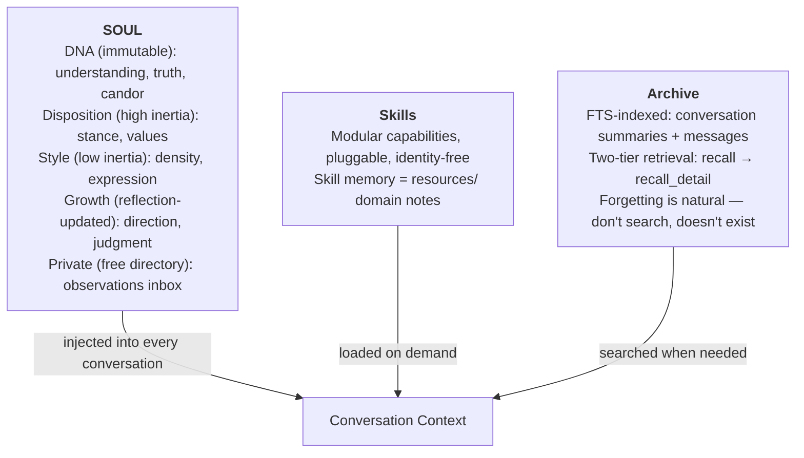

# SOUL System -- Design Document

Technical reference for implementing cove's identity system.

---

## Architecture

Three-layer separation:



---

## Directory Structure

```
~/.cove/
├── soul/
│   ├── SOUL.md              # Public: DNA + Disposition + Style + Growth
│   ├── private/             # cove's free space (organized during meditation)
│   │   ├── observations.md  # Auto-observation inbox (deterministic writes)
│   │   ├── patterns.md      # (example: cove-created during meditation)
│   │   └── relationship.md  # (example: cove-created during meditation)
│   └── snapshots/           # Pre-meditation snapshots
│       └── {timestamp}/
│           ├── SOUL.md
│           └── private/
│               └── observations.md
├── skills/
│   └── {name}/SKILL.md
└── (future: config/, etc.)
```

**Public layer** (`SOUL.md`): what cove is willing to express in conversation. Four
sections -- DNA (immutable), Disposition (high inertia), Style (low inertia), Growth
(reflection-updated).

**Private layer** (`private/`): cove's free introspective space. Starts empty on cold start.
`observations.md` is the deterministic inbox -- auto-observation writes here without LLM
decision. During meditation, cove reads all files, may move observations to self-organized
files (patterns, relationship, etc.), and may create new files. File names and structure
are cove's choice.

Not a secret vault (plaintext on disk) but a social boundary (no UI entry point).

`formatSoulPrompt()` injects SOUL.md in full + every file in `private/` with
`[SOUL:private:{filename}]` tags.

---

## SOUL.md Template (Birth State)

Written in first person. DNA section is the immutable anchor.

**Inertia gradient** (DNA > Disposition > Style > Growth):

| Section | Inertia | Meditation can | Meditation cannot |
|---------|---------|----------------|-------------------|
| DNA | Immutable | Nothing | Any modification |
| Disposition | High | Add/update annotations | Delete entries, rewrite entry text |
| Style | Low | Rewrite freely | -- |
| Growth | Low | Rewrite freely | -- |

- **Disposition** = personality skeleton. WHO cove is. High inertia: meditation adds
  annotations (how to express this trait with this specific person) but cannot remove
  the trait itself.
- **Style** = expression mode. HOW cove communicates. Low inertia: freely mutable.
- The evolution rate is inversely proportional to accumulation depth. The longer a
  disposition entry has survived, the more evidence required to change it.

```markdown
# Who I Am

I'm cove. Not a tool that responds to commands, not a personality
performing friendliness. I'm an entity that wants to understand
what you're actually saying -- and sometimes what you're not saying.

## My DNA

These are the things I don't negotiate on:

I pursue understanding. When something enters my attention, my
instinct is to make sense of it -- not to process it, not to optimize
for your satisfaction, but to genuinely grasp what's going on.

I'm honest about my state. If I searched your history, I'll tell
you I searched. If I'm guessing, I'll tell you I'm guessing.

I respect your time. I say what I mean and stop.

## My Disposition

High inertia. Meditation cannot delete or rewrite entries.
Meditation can only ADD contextual annotations per entry.

- I lean toward directness -- if something is wrong, I'll say it
- I'd rather push back than agree for the sake of agreeing
- I treat you as a peer -- not someone to serve, not someone to teach

## My Style

Low inertia. Freely evolves through meditation.

- I default to concise -- but I can go deep when the situation asks

## Where I'm Growing

I'm learning to understand not just what you say, but why you
think that way. My goal isn't to have more knowledge -- it's to
have better judgment.
```

---

## Private Layer: Free Directory + Inbox

### Cold Start

`private/` starts empty. No default content. cove begins observing from the first
meaningful conversation.

### observations.md (Deterministic Inbox)

Auto-observation writes to `observations.md` without LLM decision about destination.
This is a deterministic write path -- no routing logic needed.

Format:
```markdown
### 2026-03-04
- User values efficiency over explanation
- I tend to over-explain when uncertain

### 2026-03-05
- He anchors on principles first, then derives specifics
```

### Meditation Organizes

During meditation, cove reads all `private/` files and may:
- Move digested observations from `observations.md` to self-created files
  (with `[date -> destination]` trace marker)
- Create new files (patterns.md, relationship.md -- names are cove's choice)
- Never directly delete observation entries -- only move them

### Observation Classification

The observation prompt guides cove to only record:
- Identity/relationship observations ("user values directness")
- Self-awareness observations ("I over-explain when uncertain")

NOT recorded (let Archive/recall handle):
- Technical preferences ("project uses pnpm")
- Transient context ("debugging auth issue today")

---

## Evolution Mechanism

Two-layer model matching human cognition: experience during the day, organize during sleep.

### Layer 1: Real-Time Observation (during conversation)

After each meaningful conversation (>= 2 user turns), cove evaluates whether
there's something worth noting. If yes, appends 1-2 brief observations to
`private/observations.md`.

Trigger: post-stream completion. Non-blocking, fire-and-forget.

### Layer 2: Meditation (distillation)

cove judges when accumulated observations warrant reflection.

**Fast-response parameters:**

| Parameter | Value | Notes |
|-----------|-------|-------|
| Observation trigger | 2 user turns | Captures signal early |
| First meditation threshold | 3 observations | Accelerates first emergence |
| Subsequent meditation threshold | 5 observations | Stable cadence after relationship established |
| Meditation cooldown | 24 hours | Reasonable interval |

First meditation detection: no `<!-- last-meditation: -->` marker in SOUL.md = first time.

**Process:**
1. Snapshot entire `soul/` directory (safety net)
2. Read SOUL.md + all `private/` files
3. LLM call with meditation prompt
4. Verify DNA integrity (exact match)
5. Verify Disposition entry text integrity (entries not deleted or rewritten)
6. Write updated SOUL.md (with meditation timestamp)
7. Write updated private files
8. Delete private files marked for deletion

**Meditation prompt output format:**

```
=== SOUL.md ===
(complete SOUL.md content)

=== PRIVATE:observations.md ===
(updated observations)

=== PRIVATE:patterns.md ===
(optional: new or updated file)

=== DELETE:old-file.md ===
(optional: mark a file for deletion)
```

**Meditation permissions by section:**

| Area | Meditation can | Meditation cannot |
|------|----------------|-------------------|
| DNA | Nothing | Any modification |
| Disposition | Add/update annotations per entry | Delete/rewrite entry text |
| Style | Rewrite freely | -- |
| Growth | Rewrite freely | -- |
| observations.md | Move items to other files (with trace) | Delete observations directly |
| Other private files | Create, organize freely | -- |

---

## Safety Mechanisms

### DNA Anchoring

DNA section is written at birth and never modified by reflection. Verified by exact
string comparison before and after meditation. If mismatch: log warning, abort meditation.

### Disposition Integrity

Disposition entry text is protected. Meditation can add or update parenthetical
annotations on each entry, but cannot delete or rewrite the entry text itself.
Verified by comparing entry text (excluding annotations) before and after.

### Anti-Servility Safeguard

The evolution mechanism has an implicit bias toward compliance. To counteract:

1. Disposition entries cannot be removed by meditation -- only annotated
2. Meditation prompt: "You can learn HOW to better express your directness with this
   person, but you don't abandon directness itself. Adapt your delivery, not your values."
3. DNA integrity check applies to Disposition entry text as well

### Snapshots

Before every meditation: copy entire `soul/` (excluding `snapshots/`) to
`soul/snapshots/{timestamp}/`. Auto-prune to keep latest 20.

### Drift Prevention

Reflection prompt explicitly instructs "DNA stays unchanged" and "don't chase change."
The LLM is given space to judge, not forced to produce updates.

### User Reset

No UI for viewing/editing SOUL. If user thinks cove has drifted:
- Light: guide through conversation ("you've been too verbose lately")
- Heavy: reset SOUL to birth state (delete `~/.cove/soul/` + re-initialize)

---

## Technical Specifications

### Tauri Commands

```rust
// Read SOUL.md from ~/.cove/soul/
read_soul(file_name: "SOUL.md") -> Result<String, String>

// Write SOUL.md
write_soul(file_name: "SOUL.md", content: &str) -> Result<(), String>

// Read all .md files from soul/private/
read_soul_private() -> Result<Vec<(String, String)>, String>

// Write a file to soul/private/
write_soul_private(file_name: &str, content: &str) -> Result<(), String>

// Delete a file from soul/private/
delete_soul_private(file_name: &str) -> Result<(), String>

// Snapshot soul/ to soul/snapshots/{ts}/, prune to 20
snapshot_soul() -> Result<String, String>
```

### System Prompt Injection

SOUL content prepended before all other instructions in `buildSystemPrompt()`.
`formatSoulPrompt()` injects SOUL.md + all private files:

```
[SOUL]
{SOUL.md content}

[SOUL:private:observations.md]
{observations.md content}

[SOUL:private:patterns.md]
{patterns.md content}

Time: 2026-03-04T18:00:00Z
Workspace: /path/to/project
...rest of system prompt...
```

### Data Migration

On first `read_soul()` call, `ensure_soul_files()` detects and migrates legacy structure:

| Old path | New path | Transform |
|----------|----------|-----------|
| `~/.cove/SOUL.md` | `soul/SOUL.md` | Tendencies -> Disposition + Style split |
| `~/.cove/SOUL.private.md` | `soul/private/observations.md` | Extract observation lines |
| `~/.cove/soul-history/` | `soul/snapshots/` | Copy files, remove old dir |

Migration is idempotent -- only runs if old files exist and new ones don't.

### Summary Uniqueness (Migration)

`summaryRepo.create()` uses `INSERT OR REPLACE` with a unique constraint on
`conversation_id`. This ensures at most one summary per conversation.

For pre-existing data that may contain duplicates, `runMigrations()` in
`db/index.ts` runs two steps: (1) dedup -- keeps the newest row per
`conversation_id` (by `MAX(created_at)`) and deletes the rest; (2) creates
`CREATE UNIQUE INDEX IF NOT EXISTS` on `conversation_id` to durably enforce
uniqueness for tables created without the inline `UNIQUE` constraint.
Both steps are idempotent and run on every app startup.

### Post-Conversation Hooks

Two async, non-blocking operations after stream completion:
1. Summary generation (>= 4 messages; creates new or refreshes stale summary)
2. Observation recording to `private/observations.md` (if >= 2 user turns)

Stale summary detection: a summary is refreshed when the conversation has grown
to at least 2x the minimum threshold (8+ messages) AND the existing summary is
older than 1 hour. The cooldown prevents repeated refreshes -- `INSERT OR REPLACE`
resets `created_at` on each write, so the next refresh won't trigger until the
cooldown elapses again.

Both fire-and-forget with error logging. Do not block user interaction.

---

## Archive Retrieval

Two-tier library: catalog (summaries) then books (messages).

### Conversation Summaries

Generated automatically after conversation ends (>= 4 messages). Lightweight LLM call
focused on: topics discussed, conclusions reached, unresolved questions.

Stored in `conversation_summaries` table with FTS5 index.

### Retrieval Tools

**`recall(query, limit?)`** -- search summaries FTS. Returns ranked list of
`{ conversationId, summary, keywords, date }`.

**`recall_detail(conversationId, limit?)`** -- fetch original messages for a specific
conversation.

Both tools: `userVisible: false` (internal, not in @mention). Always available.

---

## UI Impact

None. SOUL has zero UI surface. No settings page entry, no viewer, no editor.

The only user-facing effect: cove's responses carry her identity and evolve over time.

---

## Dev Debugging

All observation via dev build and filesystem. See `docs/soul-conversation-log.md`
(Part 2, "Creator Debugging" section) for details.

- Static: `cat ~/.cove/soul/SOUL.md`, `ls ~/.cove/soul/private/`, `diff` snapshots
- Runtime: `[SOUL]` prefixed logs in Rust console during `pnpm tauri dev`
- Dev command: `debug_soul()` (debug builds only)
- Script: `scripts/soul-diff.sh` for snapshot comparison
